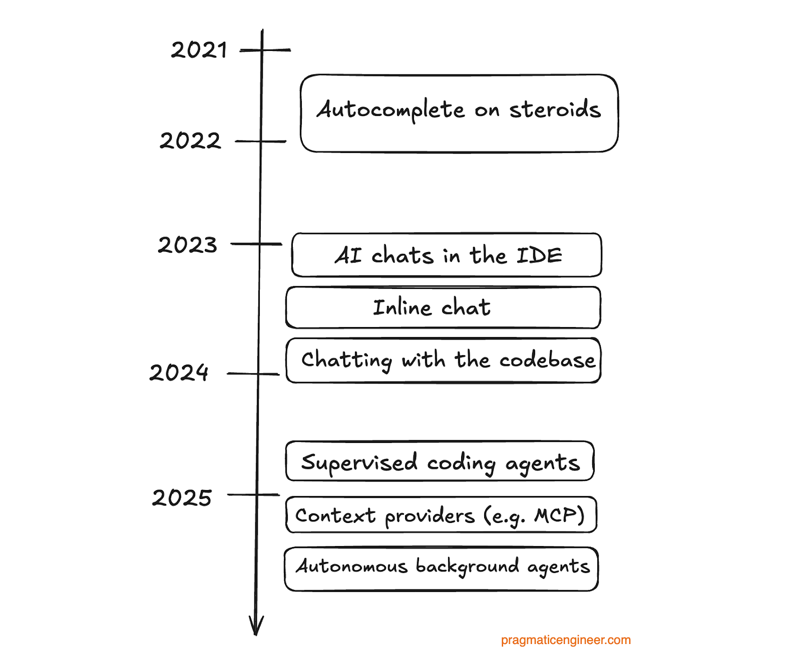

### AI / Augmented Coding

#### 🤖 OpenAI / ChatGPT / Transformers

* 🌐 [ChatGPT is everywhere. Here’s where it came from](https://www.technologyreview.com/2023/02/08/1068068/chatgpt-is-everywhere-heres-where-it-came-from/)
  * traditionally language models have been using RNN (recurrent neural networks)
  * in 2017 a group of Google researchers invented *transformers* - described in 🌐 [Att ention Is All You Need](https://papers.nips.cc/paper/2017/file/3f5ee243547dee91fbd053c1c4a845aa-Paper.pdf)
* 🌐 [How ChatGPT actually works](https://www.assemblyai.com/blog/how-chatgpt-actually-works/)
* 🌐 [How does ChatGPT work? Tracing the evolution of AIGC](https://www.dtonomy.com/how-does-chatgpt-work/)
* 🌐 [The Guardian - Race to AI: the origins of artificial intelligence, from Turing to ChatGPT](https://www.theguardian.com/technology/2023/oct/28/artificial-intelligence-origins-turing-to-chatgpt)

#### 🤖 Details of LLMs

🌐 [NeoSage Blog](https://blog.neosage.io)

* **Part 1 pre-training - the base model** - 🌐 [How GPTs Are Born: Internet Feeding, Token by Token](https://blog.neosage.io/p/how-gpts-are-born-internet-feeding)
  * basically a lossy compression of the Internet
  * guesses, does not retrieve current information
  * just a "pattern generator"
  * stochastic, not deterministic
* **Part 2 post-training** - 🌐 [How GPTs Learn to Be Helpful](https://blog.neosage.io/p/how-gpts-learn-to-be-helpful)
  * *supervised fine-tuning* (SFT)
  * *reinforcement learning* (RL)
  * *reinforcement learning with human feedback* (RLHF)
  * 🌐 [So What Are You Really Talking To?](https://blog.neosage.io/i/161930085/so-what-are-you-really-talking-to)
    > 💡 *When you chat with GPT, you’re not talking to a mind.*
    > *You’re talking to a model that has:*
    > * *Compressed much of the internet into its parameters*
    > * *Learned assistant behaviour from curated examples*
    > * *Discovered reasoning patterns through RL*
    > * *Aligned itself with human judgment through preference modelling*
    >
    > *It’s not magic.*
    > *It’s layers of optimisation—stacked, fine-tuned, and trained to predict your next token.*
    >
    > *LLMs don’t understand. They don’t reason.*
    >
    > 💡 *Treat them as engines to design around, not minds to build on.* 💡
  * LLM models has two kinds of memory
    * *Parameter memory* - baked into the model weights
    * *Context memory* - fed dynamically via the prompt
    * only *context memory* can be changed post-deployment
  * for facts, use *external tools* (RAG - retrieval augmented generation) - like calculators (Python) to do math, or search engines to look up facts
  * this is modern LLM architecture in a nutshell
    * *Know when to predict, and when to execute (i.e. call 'tools')*

#### 🤖 Working with Augmented Coding

The Pragmatic Engineer - 🌐 [Learnings from two years of using AI tools for software engineering](https://newsletter.pragmaticengineer.com/p/two-years-of-using-ai) - guest post by Birgitta Böckeler, Distinguished Engineer at Thoughtworks

* 🌐 [**working with generative AI**](https://newsletter.pragmaticengineer.com/i/166399878/working-with-ai)
* **Mental Model** keep a **mental model** of the AI teammate
  * *Eager to help*
  * *Stubborn, and sometimes with a short-term memory*
  * *Very well-read, but inexperienced*
  * *Overconfident!*
* **Biases** beware of different kind of biases
  * *automation bias* - don't overtrust just because it is automated output
  * *framing effect* - generative AIs are very confident, don't take it for face value
  * *anchoring effect* - remember to investigate other paths that just the one suggested by AI
  * *sunk cost fallacy* - since less human time is invested into the code, it should actually be easier to throw away generated code
* **Workflow** the generative agent workflow
  * *custom instructions* - rule sets for the agents about coding style, tech stack, etc.
  * *plan first* - break down the work into smaller tasks
  * *small tasks* - small tasks gives better results - stay in the loop
  * *be concrete*
  * *memory* - keep a memory file, let the agent update it
    * example the [cline memory bank](https://docs.cline.bot/prompting/cline-memory-bank)

#### 🤖 Prompt Engineering Guides

* 🌐 [**Cline** - Prompt Engineering Guide](https://docs.cline.bot/prompting/prompt-engineering-guide)
