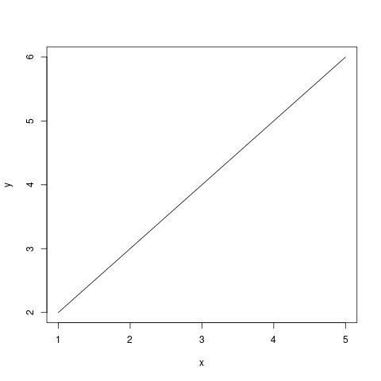

### R Statistical Language

* https://www.r-project.org/

* [R Graphics Cookbook](https://r-graphics.org)

#### Install (Ubuntu)

* [README](https://cloud.r-project.org/bin/linux/ubuntu/README)
* [List of versions](https://cloud.r-project.org/bin/linux/ubuntu/)

* `sudo apt install r-base-core`
* `export R_LIBS_USER=$HOME/opt/R/lib` - set the library path for installing libraries

#### Environment

* `R` - REPL
* Make an R Script executable by setting shebang to:
  `#!/usr/bin/Rscript`

#### Demos

##### Plotting the x,y content of a CSV file ([plotcsv.r](./demos/plotcsv.r))

[`plot` documentation](https://www.rdocumentation.org/packages/graphics/versions/3.6.2/topics/plot)

```R
# small sample that reads data from a CSV file and
# uses 'plot' for creating both a png and a pdf with the data plotted

data <- read.csv("datafile.csv", header = TRUE) # Read from csv file

print(data)             # Print the file contents.
print(data$x)           # Print values for column X
print(data[2])          # Print values for column '2'

png("out/plotcsv.png")  # Specify the png output file name
plot(data, type = "l")  # Plot the values as a line = l

pdf("out/plotcsv.pdf")  # Specify the pdf output file name
plot(data, type = "l")  # Plot the values as a line = l
```

The output as png (see [plotcsv.pdf](./demos/out/plotcsv.pdf) for the pdf output)


